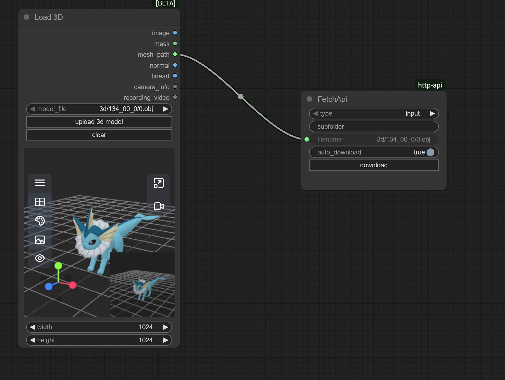

# ComfyUI HTTP API

A collection of custom nodes for interacting with ComfyUI's internal HTTP APIs, such as fetching files from workflows.

## Features

- 🚀 **File Download**: Download files from ComfyUI's input or output directories
- 🔄 **Auto Download**: Support automatic file download after workflow execution
- 🎯 **Manual Control**: Provides download button for manual downloads
- 📁 **Subfolder Support**: Support fetching files from subfolders
- 🛤️ **Path Handling**: Intelligent path parsing for files with relative paths
- 🔒 **Secure Download**: Uses ComfyUI's built-in API for security

## Installation

### Method 1: Via ComfyUI Manager

1. Search for "ComfyUI HTTP API" in ComfyUI Manager
2. Click Install

### Method 2: Manual Installation

1. Navigate to ComfyUI's `custom_nodes` directory:
   ```bash
   cd ComfyUI/custom_nodes/
   ```

2. Clone this repository:
   ```bash
   git clone https://github.com/jtydhr88/comfyui-http-api.git
   ```

3. Restart ComfyUI

## Usage

### Node Description

The **Fetch** node is used to download files from the ComfyUI server.

#### Input Parameters

- **type** (`combo`): File type
  - `input`: Download from input directory
  - `output`: Download from output directory
  
- **subfolder** (`string`): Subfolder path (optional)
  - Leave empty for root directory
  - Example: `subfolder1/subfolder2`
  
- **filename** (`string`): File name to download
  - Can be just filename: `image.png`
  - Or include relative path: `models/3d/mesh.obj`
  - The node will automatically parse and handle paths correctly
  
- **auto_download** (`boolean`): Enable automatic download
  - `true`: Auto-download after workflow execution
  - `false`: Manual download via button click required

#### UI Elements

- **download button**: Manually trigger file download

### Usage Examples

#### Example 1: Download Generated Images

1. Add a **Fetch** node to your workflow
2. Set parameters:
   - type: `output`
   - subfolder: `(leave empty or specify subfolder)`
   - filename: `ComfyUI_00001_.png`
   - auto_download: `true`
3. Run workflow, file will download automatically

#### Example 2: Manual Download of Input Files

1. Add a **Fetch** node
2. Set parameters:
   - type: `input`
   - subfolder: `images`
   - filename: `example.jpg`
   - auto_download: `false`
3. After running workflow, click the download button to download the file

#### Example 3: Download Files with Relative Paths

1. Add a **Fetch** node
2. Set parameters:
   - type: `output`
   - subfolder: `(leave empty)`
   - filename: `3d/models/mesh.obj` (path included in filename)
   - auto_download: `true`
3. The node will automatically parse the path and download the file correctly

This allows automatic download to local storage after file generation.

## Technical Details

### API Endpoint

The plugin uses ComfyUI's built-in `/view` API endpoint:

```
GET /view?filename={filename}&type={type}&subfolder={subfolder}
```

### Path Handling

The node intelligently handles various path formats:
- `filename = "mesh.obj", subfolder = "3d"` → Works normally
- `filename = "3d/mesh.obj", subfolder = ""` → Parses to `subfolder="3d", filename="mesh.obj"`
- `filename = "models/3d/mesh.obj", subfolder = "output"` → Merges to `subfolder="output/models/3d", filename="mesh.obj"`

### File Structure

```
comfyui-http-api/
├── src/main.ts          # Frontend extension logic (TypeScript source)
├── js/main.js           # Compiled JavaScript for the frontend
├── __init__.py
├── ComfyUIHttpApi.py    # Backend node definition
├── README.md            # This document
└── LICENSE              # MIT License
```

## Troubleshooting

### Common Issues

1. **"Unable to fetch file" error**
   - Ensure the file exists in the specified directory
   - Check if the filename is correct (including extension)
   - Verify the subfolder path is correct
   - If using relative paths in filename, ensure the full path is valid

2. **Auto-download not working**
   - Ensure `auto_download` is set to `true`
   - Check if browser is blocking automatic downloads
   - Some browsers may require user interaction for downloads

3. **Node not appearing in node list**
   - Ensure plugin is properly installed in `custom_nodes` directory
   - Restart ComfyUI
   - Check console for error messages

4. **Files with paths not downloading**
   - The node now supports paths in filenames (e.g., `folder/file.ext`)
   - Ensure the complete path exists in the specified type directory

## Development

### Prerequisites

- Node.js and TypeScript (for frontend development)
- Python 3.10+ (for backend development)
- ComfyUI development environment

### Building

```bash
# Install dependencies
npm install

# Compile TypeScript
npm run build
```

## Contributing

Contributions are welcome! If you have ideas for improvements or have found bugs, feel free to:

- Open an issue
- Submit a pull request with proposed changes

### Contribution Guidelines

1. Fork the repository
2. Create your feature branch (`git checkout -b feature/AmazingFeature`)
3. Commit your changes (`git commit -m 'Add some AmazingFeature'`)
4. Push to the branch (`git push origin feature/AmazingFeature`)
5. Open a Pull Request

## Roadmap

- [ ] Add more comfyui internal http apis
- [ ] Support batch download of multiple files
- [ ] Add download progress display
- [ ] Support file preview functionality

## License

[MIT License](LICENSE)

## Contact

For questions or suggestions, please contact via:

- Submit an [Issue](https://github.com/jtydhr88/comfyui-http-api/issues)